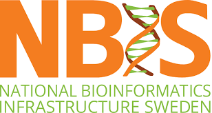

 

# Genome Annotation Workshop

**Date and Location:**

The workshop is held at the Uppsala Biomedical Center, Uppsala, Sweden, on May 15-17 2019.

## Course Purpose

The course is aimed at researchers that are involved in on-going or upcoming genome projects and wish to deepen their understanding of the various forms of data and computational steps required to achieve a comprehensive annotation. The focus of the course will be on non-model eukaryote organisms, and in particular the structural annotation of protein coding genes.

## Prerequisites

This is an advanced course. Participants must be comfortable navigating a Linux shell and executing 
programs from the command line. Previous experience from working with NGS data is beneficial. Applicants 
are encouraged to bring their own laptops, but there will be computers to use for participants unable to do so.

Test your Unix comfort with these exercises: [NGS Introduction - Introduction to Linux](https://scilifelab.github.io/courses/ngsintro/1809/labs/linux-intro)

## Where to apply

Please follow the link here: [SciLifeLab Events Page - De Novo Genome Annotation](https://www.scilifelab.se/events/introduction-to-genome-annotation/)
